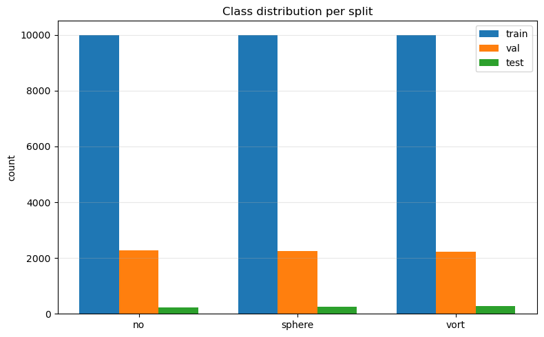
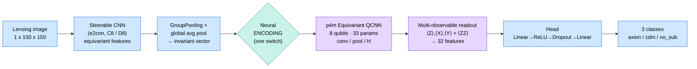
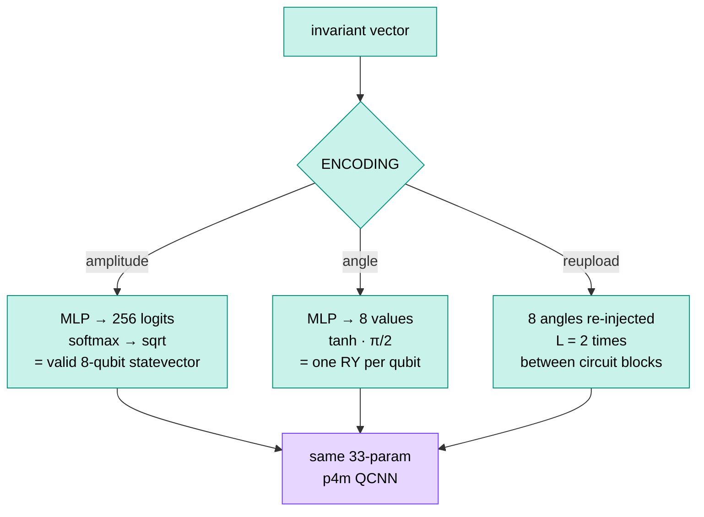
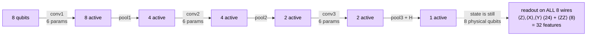
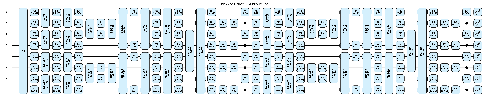

# Quantum Visual Fields for Dark Matter Substructure Classification

This project studies **Quantum Visual Fields (QVF)** — a symmetry-aware hybrid quantum-classical network for classifying dark matter substructure in strong gravitational lensing images. Lensing images carry subtle signatures that distinguish competing dark matter models: Cold Dark Matter, Axion / Fuzzy Dark Matter, and no-substructure cases.

Instead of leaning on large pretrained backbones and heavy augmentation, QVF encodes the rotational and reflectional symmetries of lensing physics **directly into the architecture** — in both the classical feature extractor and the quantum circuit. The result is one compact model whose predictions are invariant under 90° rotations and reflections by construction.

The key idea is a single shared design: one steerable-CNN front-end and one p4m equivariant quantum circuit, with **three switchable *neural* encodings** that decide how the image is loaded onto the qubits — neural **amplitude**, neural **angle**, and neural **data re-uploading**. Because the backbone and circuit are identical across all three, the comparison isolates exactly one thing: how you load the data into the register.

## Project Description

Strong gravitational lensing is a powerful probe of dark matter and large-scale structure. The visual morphology of a lensing image encodes small perturbations caused by dark matter substructure, but the signal is faint and high-dimensional.

A lensing image has no preferred orientation: rotating or mirroring it does not change its class. Formally the label is invariant under the dihedral group `D4 = p4m point group` (90° rotations and reflections). Standard CNNs and ImageNet backbones only learn this from augmentation, which spends model capacity on a symmetry we can instead build in. QVF replaces:

- the classical backbone with an `e2cnn` group-equivariant steerable CNN (`C8` / `D8`), and
- the generic variational quantum circuit with a quantum circuit whose gates and parameter-sharing pattern make every layer commute with every element of the p4m group.

## Dataset

Trained and evaluated on the **DeepLense Model_I** three-class strong-lensing dataset (150×150 images): `no_sub` (no substructure), `cdm` (subhalo / CDM-like), and `axion` (vortex / axion-like). The training split has 70,021 images and the held-out test split has 15,000 images (5,000 per class).

The figure below shows four random samples from each of the three classes — `no_sub` (top row, smooth Einstein rings), `cdm` / sphere (middle, ring + a compact subhalo), and `axion` / vort (bottom, vortex-perturbed arcs). The differences are subtle and the rings appear at arbitrary orientations, which is exactly why an orientation-invariant model helps.

## Methodology

The whole model is a single forward pass. We hold the backbone and the circuit fixed and only swap the encoding block, so any difference in the numbers comes from the encoding alone.

Blue = classical equivariant CNN · teal = the encoding bridge · purple = the quantum circuit. The three encodings (below) plug into the same `D` slot.

### 1. From the image to a symmetry-invariant vector

The front-end is a steerable CNN built with `e2cnn` (`R2Conv` + `InnerBatchNorm` + ReLU + antialiased pooling), following the GSoC-23 `C8SteerableCNN` design, on the rotation group `C8` (or `D8` once mirrors are switched on). A final `GroupPooling` collapses each regular-representation field to a scalar, and a global average pool turns the feature map into one compact vector that is invariant under 90° rotations and reflections. This single invariant vector is the input every encoding sees, which is what makes the three-way comparison fair.

### 2. The encoding block (the only thing that changes)

"Neural" here means a small trainable network produces the numbers we load onto the qubits, rather than reading raw pixels. This keeps faint lensing arcs from being washed out and guarantees the qubit state is always valid.

- **Neural amplitude (the QVF encoding).** A linear layer maps the invariant vector to 256 logits. We pass those through a softmax to get a probability vector that sums to 1, then take the element-wise square root. The result is a length-256 real vector with unit L2 norm, which is exactly a valid 8-qubit statevector (`||a||₂ = 1`), and we load it with amplitude embedding. This uses the full `2⁸ = 256`-dimensional Hilbert space, so it is the most expressive encoding, but squeezing everything through 256 tied amplitudes also makes it the hardest to optimise, which is why its accuracy comes in lowest of the three.
- **Neural angle.** The network outputs 8 numbers, each bounded with `tanh·(π/2)` and applied as a single `RY` rotation on its qubit. Smooth, stable, easiest to train, and the best performer.
- **Neural re-uploading.** The same 8 angles are re-injected `L` times (here `L = 2`) between circuit blocks, giving the quantum part more work to do and more expressivity.

### 3. The equivariant quantum circuit

The circuit is a faithful TorchQuantum port of the EQNN-for-HEP p4m equivariant QCNN. It runs on 8 qubits with only **33 trainable parameters**, weight-tied across the p4m orbits so the whole circuit commutes with 90° rotations and reflections by construction. It is a standard convolution/pooling QCNN:

- **Equivariant convolution `U2` (6 params):** `RX, RX, IsingZZ, RX, RX, IsingYY`.
- **Equivariant pooling (5 params):** `RX, RX, RY, RZ, CRX`.

The active qubits are halved at each pooling step until one is left, just like a classical conv/pool stack:

> The `8 → 4 → 2 → 1` count is the **logical** number of *active* wires the conv/pool gates operate on (the HEP-style QCNN structure). The state is always 8 physical qubits — pooling concentrates information onto fewer wires rather than deleting qubits — so at the end we read observables on **all 8 wires**, not just the single pooled qubit. The original HEP repo measured only that one centre qubit (fine for binary classification); for 3-class lensing we widen the readout to 32 features, because the 1-qubit (and even the 8-value `⟨Z⟩`-only) readout was a bottleneck that pinned the loss near `ln(3)`.

`IsingZZ` and `IsingYY` are built from native `CNOT·RZ·CNOT` (with `RX(±π/2)` basis changes for `YY`), and we checked that they match the PennyLane originals bit-for-bit. Everything is expressed with batched `rx/ry/rz/cnot/crx` gates so the circuit trains end-to-end on GPU with autograd.

The figure below is the full trained circuit drawn from the notebook: the 8 horizontal wires are the qubits, and reading left to right you can see conv1 over all 8 wires, then pool1 dropping to 4 active wires, conv2, pool2, conv3, pool3, the final Hadamard, and the measurement boxes on the right. The repeated `RX`/`IsingZZ`/`IsingYY` blocks with shared angles are the 33 weight-tied parameters that make the circuit p4m-equivariant.

### 4. Readout and head

Reading only `⟨Z⟩` on the 8 wires turned out to be a bottleneck: 8 numbers were too few and the loss got stuck near `ln(3)`. So we widen the readout to `⟨Z⟩, ⟨X⟩, ⟨Y⟩` per wire (24 features) plus `⟨Zᵢ Zⱼ⟩` on the conv1 orbit pairs (8 more), for 32 features in total. The `⟨X⟩`/`⟨Y⟩` terms come from a basis change (`H` / `RX(π/2)`) before measuring `Z`, and the `⟨ZZ⟩` terms come straight from `|ψ|²`, so they are all read off the same final state. A flag-gated hybrid residual can also concatenate the invariant CNN vector (projected to 16 dims) into the head, which lets us report both a pure-quantum-readout number and a hybrid number. The classifier head is `Linear → ReLU → Dropout(0.2) → Linear → 3 classes`.

## Results

All three QVF variants share the **same** steerable-CNN front-end and the **same** 33-parameter p4m equivariant QCNN — only the neural encoding differs — so this is a controlled comparison of how to load a lensing image into the qubit register. Evaluated on the held-out **DeepLense Model_I** test set (15,000 samples, 3 balanced classes: `axion`, `cdm`, `no_sub`).

| Encoding | Test Acc | Macro F1 | Test ROC AUC | Quantum params | Total params |
| --- | ---: | ---: | ---: | ---: | ---: |
| Neural angle (`tanh·π/2 → RY`) | **98.77%** | **0.9877** | **0.9991** | 33 | 8.91M |
| Neural re-uploading (`L = 2`) | 98.46% | 0.9846 | 0.9990 | 66 | 9.89M |
| Neural amplitude (`softmax → √`, QVF) | 95.46% | 0.9544 | 0.9948 | 33 | 9.92M |

Per-class ROC AUC for the best (angle) variant: `axion` 0.9992 · `cdm` 0.9984 · `no_sub` 0.9998. As elsewhere, `no_sub` is the easiest class (≈ 99.9% recall) and the `axion` vs. `cdm` boundary is the hardest.

**Takeaway:** the three encodings share the exact same backbone and circuit, so the gap between them is purely an encoding effect. Neural **angle** is the easiest to optimise and lands at the top (98.77%). Neural **amplitude** packs the whole invariant vector into a 256-amplitude state on 8 qubits, which is the most expressive but also the tightest bottleneck to train through; it comes in lower at **95.46%** but still well clear of chance, so the amplitude state is clearly carrying real class signal. **Re-uploading** sits between the two. In short, how you load the image into the register matters more than the circuit, which is identical in all three cases.

## Is the quantum circuit actually learning? (ablation)

A fair question with any hybrid model is whether the quantum part is doing real work, or whether the classical encoder is quietly carrying the whole thing. We ran a controlled ablation in [`notebooks/equivariant/eqnn_hep_torchquantum/eqnn_hep_p4m_qcnn_lensing_ablation.ipynb`](notebooks/equivariant/eqnn_hep_torchquantum/eqnn_hep_p4m_qcnn_lensing_ablation.ipynb), which uses the same EQNN-for-HEP equivariant filters (`U2`/`U4` built from `RX` + `IsingZZ`/`IsingYY`, tied per p4m orbit) that the QVF circuit is built from.

The setup keeps the encoder and the classification head **byte-for-byte identical** and only swaps the `256 → 8` core. Same data, same epochs, same optimizer, same seed — so any gap is the core, not capacity or luck. Three cores are compared:

- **quantum** — the equivariant QCNN (`U2`/`U4` + pooling), ~33 trainable params,
- **fixed** — a parameter-free block-sum of the encoded amplitudes (0 params; the encoder + head floor),
- **classical** — a small learnable low-rank linear mixer (~264 params).

**Run 1 — trainable encoder (the deployed hybrid).** The encoder is free to learn.

| Core | Test Acc | Macro AUC | Macro F1 | Core params |
| --- | ---: | ---: | ---: | ---: |
| quantum | 81.87% | 0.9257 | 0.8155 | 33 |
| fixed | 81.79% | 0.9230 | 0.8153 | 0 |
| classical | 81.83% | 0.9177 | 0.8156 | 264 |

All three tie at ~82%. A 0-parameter reduction matches the quantum circuit exactly, which means the learnable encoder has already separated the classes and the core barely matters downstream. On its own this looks like "the circuit does nothing" — but that is an artifact of an over-capable encoder, so we remove that confound next.

**Run 2 — frozen encoder (the core is the *only* trainable mixer).** The front-end is frozen to a fixed, deterministic equivariant feature map, so the core has to extract the class signal itself.

| Core | Test Acc | Macro AUC | Macro F1 | Trainable params |
| --- | ---: | ---: | ---: | ---: |
| classical | **74.99%** | 0.8853 | 0.7461 | 291 |
| quantum | 69.72% | 0.8536 | 0.6872 | 60 |
| fixed | 39.41% | 0.5601 | 0.3734 | 27 |

Now the circuit clearly comes alive: the equivariant quantum core jumps to **69.7%**, a **+30.3-point** lift over the 0-parameter floor (39.4%), and it trains smoothly with no barren plateau. So the equivariant filters genuinely learn real, nonlinear, class-relevant structure from the qubit state.

**What this tells us about the circuit.** The quantum core is not inert — once it is the thing doing the work, it learns +30 points over doing nothing. But there is **no quantum advantage** on this task: a small classical mixer still edges it out (75% vs 70%), and with a strong encoder everything ties. The honest reading of the high QVF accuracies above is therefore *equivariance + a strong classical front-end*, with the quantum layer contributing inductive bias and a learnable, symmetry-respecting representation rather than a measurable accuracy edge. (One caveat: the classical mixer has 264 params vs the quantum core's 33, so the −5-point gap is partly capacity, not purely quantum-vs-classical.)

## Notebooks

One shared steerable-CNN + p4m EquivQCNN backbone, three switchable *neural* encodings (set via a single `ENCODING` switch in the config cell):

- [`notebooks/equivariant/steerable_qvf/angle.ipynb`](notebooks/equivariant/steerable_qvf/angle.ipynb) — neural angle encoding (`tanh·π/2 → RY`); best of the three (98.77% / 0.9877 / AUC 0.9991).
- [`notebooks/equivariant/steerable_qvf/reupload.ipynb`](notebooks/equivariant/steerable_qvf/reupload.ipynb) — neural data re-uploading (`L = 2`, `33 × L` quantum params); 98.46%.
- [`notebooks/equivariant/steerable_qvf/amplitude.ipynb`](notebooks/equivariant/steerable_qvf/amplitude.ipynb) — neural amplitude encoding (`softmax → √ → AmplitudeEmbedding`, full 8-qubit Hilbert space); 95.46%.

Supporting analysis:

- [`notebooks/equivariant/eqnn_hep_torchquantum/eqnn_hep_p4m_qcnn_lensing_ablation.ipynb`](notebooks/equivariant/eqnn_hep_torchquantum/eqnn_hep_p4m_qcnn_lensing_ablation.ipynb) — controlled trainable-vs-frozen-encoder ablation on the same equivariant `U2`/`U4` filters, isolating how much the quantum core actually learns (+30 pts over a 0-param baseline when the encoder is frozen; no net quantum advantage).

## Technologies Used

- Python
- PyTorch
- **TorchQuantum** — GPU-native PyTorch-autograd quantum simulator (batched 8-qubit circuits, end-to-end gradient flow with `loss.backward()`)
- **e2cnn** — group-equivariant steerable CNNs (`Rot2dOnR2` / `FlipRot2dOnR2` for `C8` / `D8`)
- Scikit-learn metrics
- Jupyter notebooks
- Git LFS for model checkpoints

## Extension Direction

The broader Quantum ML test and extension plan that originated this work lives here: [Specific Test III Quantum ML](https://github.com/sushmanthreddy/Task_2026/tree/main/Specific_Test_III_Quantum_ML).

The detailed project plan and upcoming implementation roadmap are tracked here: [GSoC 2026 project plan](https://docs.google.com/document/d/1weWicZdYN34_GT0637SVESl5sWR9RA6lcXsXWxuc5GA/edit?usp=sharing).

## Mentors

- Michael Toomey, Massachusetts Institute of Technology
- Sergei Gleyzer, University of Alabama
- Pranath Reddy, Independent Researcher
- Rajat Shinde, University of Alabama in Huntsville

## Project Context

Project: Hybrid Quantum-Classical Representation Learning for Dark Matter Substructure Classification

Duration: 175/350 hours

Difficulty: Advanced

## Future Work

- **Cross-dataset benchmark** — run QVF across the four GSoC-2023 / DeepLense datasets (Model I 150×150 Gaussian PSF, Model II 64×64 Euclid-like, Model III 64×64 HST-like, Model IV multi-channel real galaxies), and compare against the classical `C8` steerable-CNN baselines.
- **Continuous-rotation backbones** — extend the steerable front-end to harmonic networks (continuous `SO(2)` equivariance) and equivariant wide ResNets.
- **Re-uploading depth sweep** — push `L` higher to map the expressivity / trainability trade-off of the angle encoding.
- **Noise robustness under realistic NISQ conditions** — add depolarizing / amplitude-damping / phase-damping channels to the QCNN and evaluate degradation (TorchQuantum supports all natively).
- **Hardware-aware simulations** — compile the p4m circuit to IBM / Google / IonQ native gate sets and re-run.
