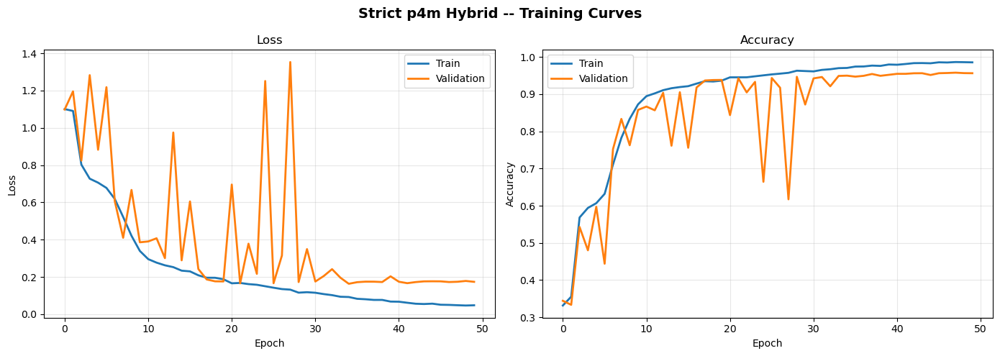
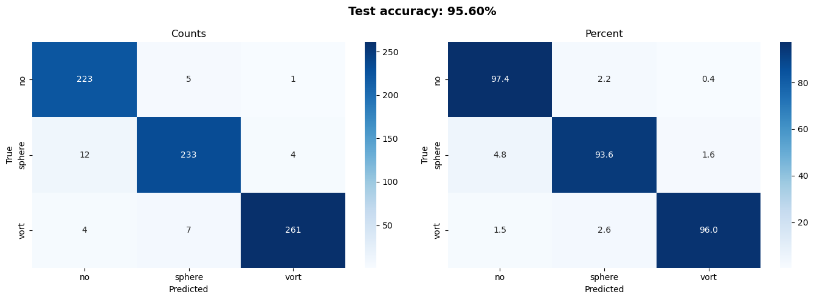
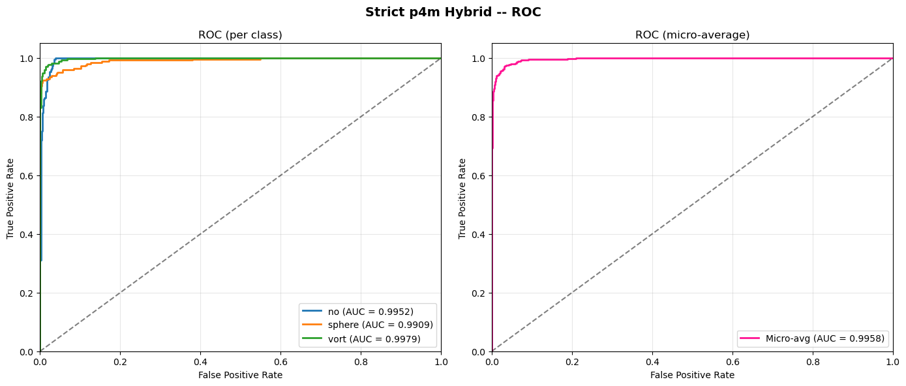
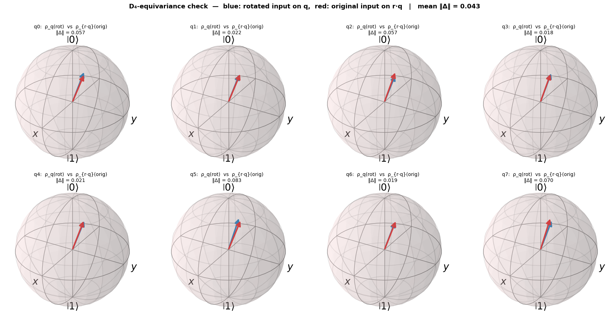
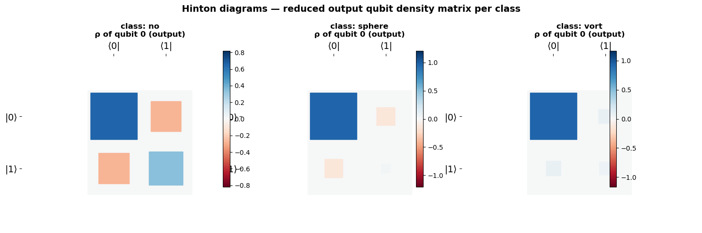
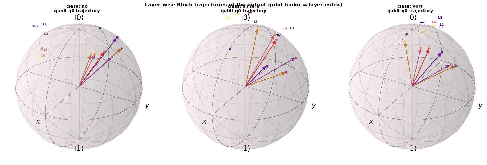
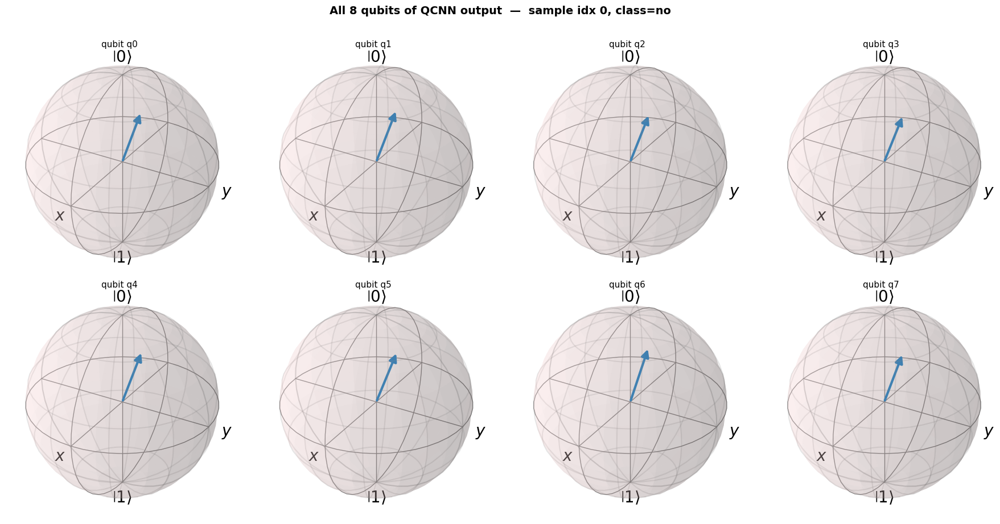

# Equivariant Quantum-Classical Networks for Dark Matter Substructure Classification

This project studies a **symmetry-aware hybrid quantum-classical network** for classifying dark matter substructure in strong gravitational lensing images. Strong lensing images contain subtle signatures that help distinguish between competing dark matter models, including Cold Dark Matter, Axion/Fuzzy Dark Matter, and no-substructure cases.

Rather than relying on large pretrained backbones and data augmentation, the models encode the rotational and reflectional symmetries of lensing physics **directly into the architecture** — both in the classical feature extractor and in the quantum circuit. The result is a family of compact, physics-aware models whose predictions are invariant under 90° rotations and reflections by construction.

This work is ongoing and is the active research focus of the project. So far it explores **three different quantum architectures** for the same 3-class task (each differing in how the symmetry is encoded at the circuit level), with continuous-symmetry and multi-dataset extensions in progress.

## Project Description

Strong gravitational lensing is a powerful probe of dark matter and large-scale structure. The visual morphology of lensing images can encode small perturbations caused by dark matter substructure, but these signals are often subtle and high-dimensional.

Gravitational lensing physics is invariant under the dihedral group `D4 = p4m point group` (rotations by 90° and reflections). Standard CNNs and pretrained ImageNet backbones only learn this property from data augmentation, which burns model capacity on a symmetry that can instead be encoded structurally. This project replaces:

- the classical backbone with an `e2cnn` **D₄ group-equivariant CNN**, and
- the generic variational quantum circuit (VQC) with a quantum circuit whose gates and parameter-sharing pattern make every layer commute with every group element of D₄.

A trainable quantum convolutional network then acts as a symmetry-preserving quantum representation layer on top of the equivariant classical features.

## Dataset

The model is trained on three-class strong-lensing images: `no` (no substructure), `sphere` (subhalo / CDM-like), and `vort` (vortex / axion-like) substructure.

## Models

All three models share the same low-level quantum primitives (`RY` angle encoding, `IsingZZ = CNOT·RZ·CNOT`, `IsingYY`, and `MeasureAll(PauliZ)`). They differ in **how the symmetry is built into the circuit** — which single-qubit rotations are allowed, whether pooling is used, and where invariance is achieved.

**1. `equiv_qnn` — angle-encoded Equivariant QCNN (baseline)**
- Classical CNN front-end reduces the image to 8 features, angle-encoded on 8 qubits.
- Quantum core: 3 conv + 3 pool blocks (a classic QCNN), pooling the active qubits `8 → 4 → 2 → 1` via controlled-RX gates.
- 2-qubit conv block uses **independent** RX angles on each wire (6 params); **33 trainable quantum parameters**.
- Symmetry is approximate (free single-qubit rotations + directional pooling).

**2. `strict_p4m_qcnn` — strict-D4 QCNN on the regular representation**
- Classical backbone: D4 steerable CNN (`FlipRot2dOnR2(N=4)`) + equivariant 1×1 conv + spatial average pooling to 8 channels.
- Quantum core: 8 qubits (`|D4| = 8`, one qubit per group element). 6 layers of SWAP-symmetric U₂ blocks with **tied** RX parameters, edges grouped by D₄-orbits with parameter sharing per orbit, **no pooling**, and a D₄-orbit polynomial-invariant readout.
- Strictly p4m by construction; **24 trainable quantum parameters**, 172,379 total.

**3. `fully_equivariant_p4m_qcnn_v2` — paper CAA EquivQCNN (best accuracy)**
- Follows Chang et al. (arXiv:2310.02323).
- Coordinate-Aware Amplitude (CAA) embedding: qubits split into an x-register and a y-register (4 + 4).
- Twirled filters `U2` (within a register) and a 4-body `U4` (links the two registers); **no single-qubit rotations** in the filters. Invariance is built into the measurement (`Rz(φ)+H` + averaging register partners).
- Provably p4m-equivariant; commutes with the induced representations `V_x, V_y, V_r`.

## Results

Evaluated on a held-out test set of 750 samples (3 classes).

| Architecture | Test Acc | Macro F1 | Test ROC AUC | Quantum params |
| --- | ---: | ---: | ---: | ---: |
| `equiv_qnn` (angle-encoded QCNN) | 96.93% | 0.969 | 0.9966 | 33 |
| `strict_p4m_qcnn` (regular rep, no pool) | 95.60% | 0.9555 | 0.9947 | 24 |
| `fully_equivariant_v2` (CAA + twirled) | **97.20%** | — | 0.9933 | 4 × depth |

**Key takeaway:** the strictest, paper-based p4m construction (`fully_equivariant_v2`) gives the best accuracy while breaking the fewest symmetry assumptions — encoding the right inductive bias matters more than model size.

The figures below are exported from the `strict_p4m_qcnn` notebook (the most extensively visualized / interpretable model).

### Training curves

### Confusion matrix

### ROC curves

## Key Findings

- All three quantum architectures exceed **95% test accuracy** on the 3-class task with very few quantum parameters — encoding the right inductive bias matters more than model size or ImageNet pretraining.
- The stricter the enforced symmetry, the better it generalizes: the fully p4m-equivariant paper model (`fully_equivariant_v2`) is the best at **97.20%**, while the approximate baseline (`equiv_qnn`) and the strict regular-rep model (`strict_p4m_qcnn`) follow closely.
- Because equivariance is built in rather than learned from augmentation, these models are strong starting points for studies that need mathematical symmetry guarantees, e.g. out-of-distribution rotated/reflected test sets and few-shot transfer to new lensing datasets.
- The `strict_p4m_qcnn` notebook ships with extensive **QuTiP visualizations** (Bloch spheres with confidence colorbar, layer-wise Bloch animations following the QuTiP `bloch-sphere-animation` tutorial, Hinton diagrams of the reduced density matrix per class, Qubism plots of the 8-qubit pure state, computational-basis probability distributions, per-layer D₄-orbit graphs, and full circuit diagrams), making the model highly interpretable.

## Equivariance Verification

Every D₄ generator is tested empirically: feeding a rotated/reflected input and comparing the resulting per-qubit Bloch vectors against the group-transformed reference. The agreement is near-exact (mean `‖Δ‖ ≈ 0.043`), confirming the circuit is p4m-equivariant by construction.

## Interpretability

The output qubit's reduced density matrix separates cleanly by class (Hinton diagrams), and the layer-wise Bloch trajectories show how each of the 6 QCNN layers steers the output qubit toward a class-dependent state.

## Notebooks

- [`notebooks/equivariant/equiv_qnn.ipynb`](notebooks/equivariant/equiv_qnn.ipynb) — CNN front-end + angle-encoded Equivariant QCNN (conv/pool `8→4→2→1`) baseline.
- [`notebooks/equivariant/strict_p4m_qcnn.ipynb`](notebooks/equivariant/strict_p4m_qcnn.ipynb) — D4-equivariant CNN + Strict p4m QCNN on the regular representation, including an explicit empirical equivariance test of every D₄ generator and extensive QuTiP visualizations.
- [`notebooks/equivariant/fully_equivariant_p4m_qcnn_v2.ipynb`](notebooks/equivariant/fully_equivariant_p4m_qcnn_v2.ipynb) — Fully p4m-equivariant hybrid with the paper CAA EquivQCNN (twirled `U2`/`U4` filters, invariant measurement).
- [`notebooks/equivariant/etn_qvit_hybrid.ipynb`](notebooks/equivariant/etn_qvit_hybrid.ipynb) — *(in progress)* Equivariant Transformer Network canonicalizer + orthogonal patch-wise Quantum ViT for continuous rotation + scale invariance.
- [`notebooks/amplitude_testing/datavisualization_amplitude.ipynb`](notebooks/amplitude_testing/datavisualization_amplitude.ipynb) — Data visualization and amplitude-encoding exploration for the lensing dataset.

## Technologies Used

- Python
- PyTorch
- **TorchQuantum** — GPU-native PyTorch-autograd quantum simulator (batched 8-qubit circuits, end-to-end gradient flow with `loss.backward()`)
- **e2cnn** — group-equivariant steerable CNNs (`FlipRot2dOnR2` for D₄ / p4m)
- **QuTiP** (with optional `qutip-qip`) — Bloch sphere visualizations, Hinton diagrams, Qubism plots, and circuit rendering
- Scikit-learn metrics
- Jupyter notebooks
- Git LFS for model checkpoints

## Extension Direction

The broader Quantum ML test and extension plan that originated this equivariant notebook lives here: [Specific Test III Quantum ML](https://github.com/sushmanthreddy/Task_2026/tree/main/Specific_Test_III_Quantum_ML).

The detailed project plan and upcoming implementation roadmap are tracked in this document: [GSoC 2026 project plan](https://docs.google.com/document/d/1weWicZdYN34_GT0637SVESl5sWR9RA6lcXsXWxuc5GA/edit?usp=sharing).

## Mentors

- Michael Toomey, Massachusetts Institute of Technology
- Sergei Gleyzer, University of Alabama
- Pranath Reddy, Independent Researcher
- Rajat Shinde, University of Alabama in Huntsville

## Project Context

Project: Hybrid Quantum-Classical Representation Learning for Dark Matter Substructure Classification

Duration: 175/350 hours

Difficulty: Advanced

## Future Work

- **Continuous invariance with ETN + Quantum ViT** *(next)* — the `etn_qvit_hybrid` notebook adds an Equivariant Transformer Network canonicalizer (continuous rotation + scale invariance) feeding an orthogonal patch-wise Quantum Vision Transformer, moving beyond discrete 90° symmetry.
- **Cross-dataset benchmark** *(next)* — run all quantum architectures across the four GSoC-2023 / DeepLense datasets (Model I 150×150 Gaussian PSF, Model II 64×64 Euclid-like, Model III 64×64 HST-like, Model IV multi-channel real galaxies), mirroring the 2023 equivariant-transformer protocol, and compare against the classical C8 baselines.
- **C8 / continuous-rotation backbones + QCNN** — extend the D₄ ECNN front-end to `Rot2dOnR2(N=8)`, harmonic networks (continuous SO(2) equivariance), and equivariant wide ResNets.
- **Quantum kernel methods** — replace the variational QCNN with a quantum kernel estimator on the equivariant features.
- **Noise robustness under realistic NISQ conditions** — add depolarizing / amplitude-damping / phase-damping noise channels to the QCNN and evaluate degradation. TorchQuantum supports all of these natively.
- **Hardware-aware simulations** — compile the strict p4m circuit to IBM / Google / IonQ native gate sets and re-run.
- **Qubit-count and depth ablations** — re-train at 4, 8, 12, 16 qubits and 2, 4, 6, 8 conv layers to find the parameter / accuracy frontier of the equivariant QCNN.
