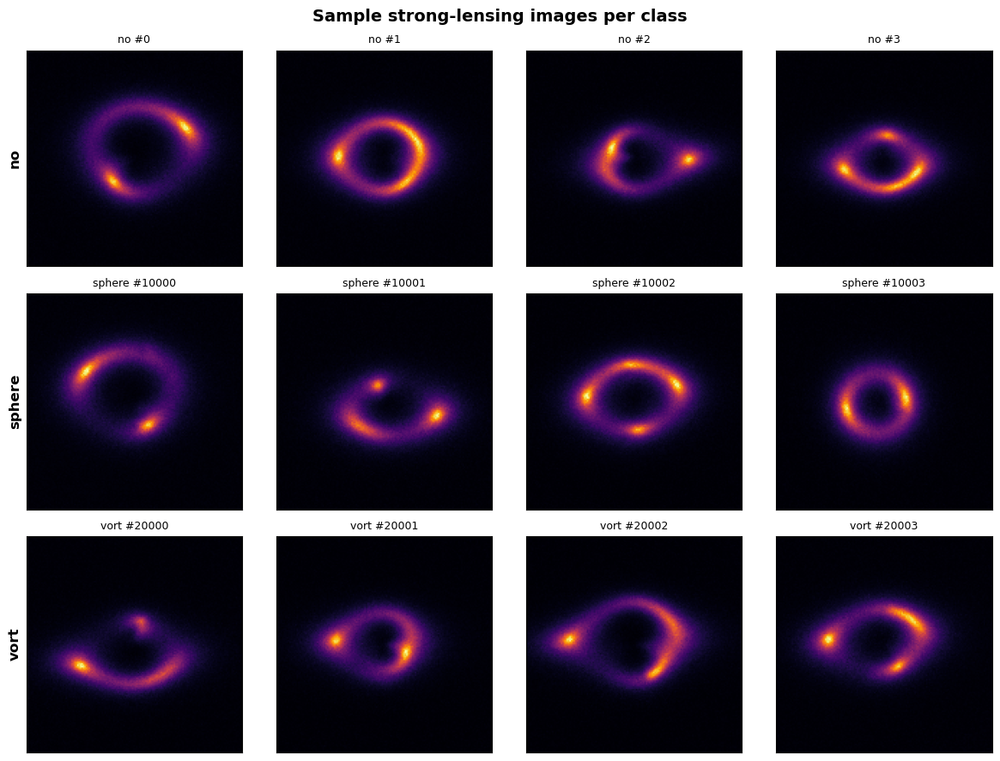
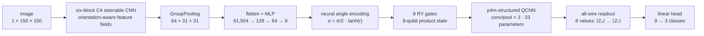
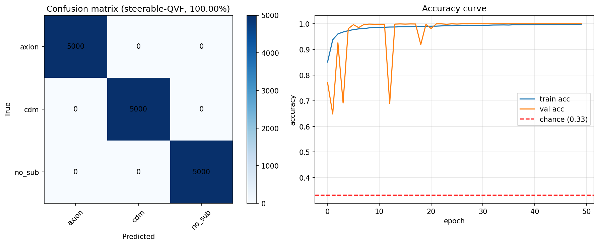
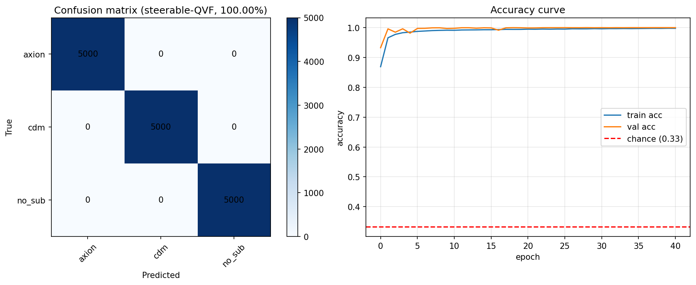
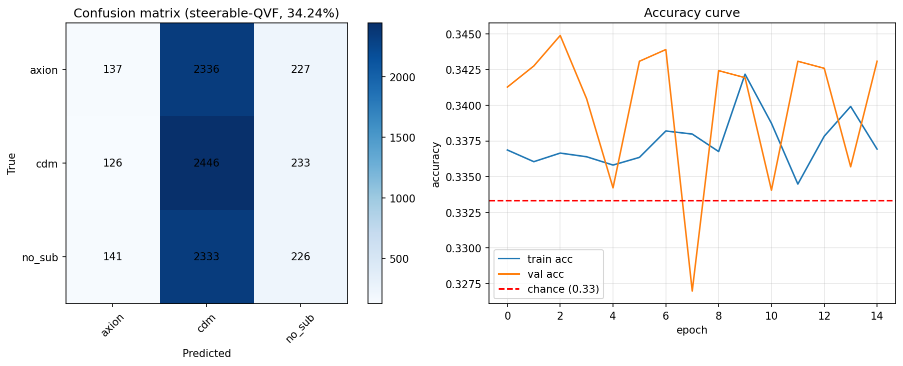
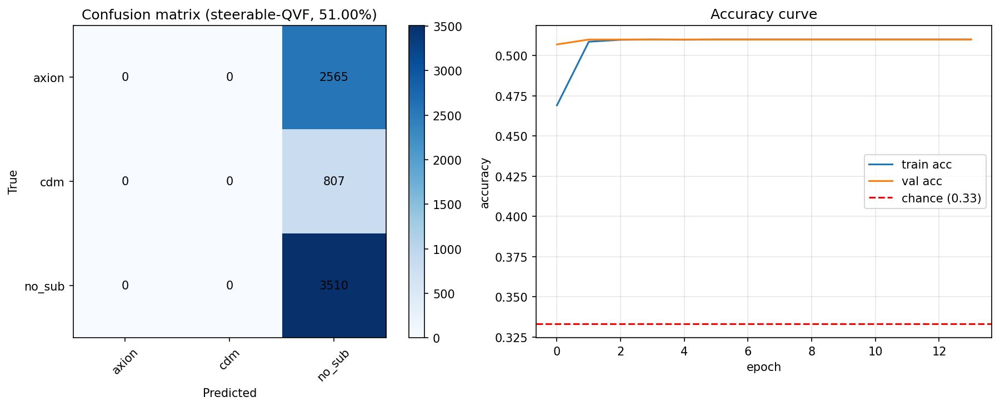
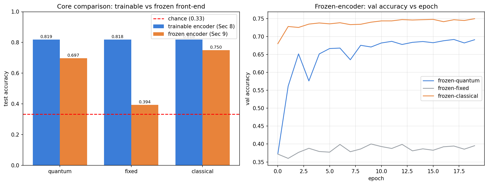

# Neural Angle Quantum Fields for Dark-Matter Substructure Classification

This repository studies a **Neural Angle Quantum Field (NAQF)**: a symmetry-aware hybrid quantum-classical classifier for identifying dark-matter substructure in simulated strong-gravitational-lensing images. A steerable CNN compresses each image into eight learned angles, those angles are loaded into an eight-qubit state with `RY` gates, and a 33-parameter p4m-structured quantum convolutional circuit produces the features used for three-class classification.

> **Audited scope.** This document is based on the executed notebooks and saved artifacts under `notebooks/equivariant/**`, selected **non-equivariant** baselines in the supplied DeepLense repository, and the cited Quantum Visual Fields paper. The root `experiment/` directory and the DeepLense equivariant projects are intentionally excluded.

> **Result in one sentence.** The complete hybrid system reaches **98.77%, 100%, and 100%** test accuracy on DeepLense Models I–III and exceeds the selected repository EfficientNet evaluations on the corresponding named datasets; Models IV and V fail at chance/majority behavior. This is a promising **system-level result**, not evidence of quantum advantage: 8,913,640 of the model's 8,913,700 trainable parameters are in the classical encoder, the comparison protocols differ, and the supporting frozen-feature core swap still favors a larger classical mixer.

## Contents

- [Scientific question](#scientific-question)
- [Data](#data)
- [Method](#method)
- [Mathematical formulation](#mathematical-formulation)
- [Why angle encoding instead of QVF amplitude encoding?](#why-angle-encoding-instead-of-qvf-amplitude-encoding)
- [Experimental protocol](#experimental-protocol)
- [Five-dataset results](#five-dataset-results)
- [Comparison with DeepLense classical models](#comparison-with-deeplense-classical-models)
- [Is the quantum circuit actually learning?](#is-the-quantum-circuit-actually-learning)
- [What the evidence does and does not show](#what-the-evidence-does-and-does-not-show)
- [Reproduction](#reproduction)
- [Repository map](#repository-map)
- [Next experiments](#next-experiments)

## Scientific question

Strong lensing bends light from a distant source into arcs and Einstein rings. Small perturbations to those structures can encode the morphology of dark-matter substructure. The classifier predicts one of three labels:

- `axion`: vortex-like axion/fuzzy-dark-matter substructure;
- `cdm`: cold-dark-matter point-mass subhalos;
- `no_sub`: no added substructure.

The task is difficult because the discriminating signal is small relative to the full image and the label should not depend on the orientation of the lens. The project asks three concrete questions:

1. Can a rotation-aware classical encoder learn a compact, task-specific quantum input?
2. Can a small orbit-shared quantum circuit mix those features usefully?
3. Does the resulting hybrid system compare favorably with classical DeepLense models?



## Data

Models I–IV follow the DeepLense simulation family. Their physical definitions are documented in [DeepLense](https://github.com/ML4SCI/DeepLense#2-datasets) and [DeepLenseSim](https://github.com/mwt5345/DeepLenseSim):

| Dataset | Source/instrument model | Split used by this project | Executed sizes (train / val / test) |
| --- | --- | --- | ---: |
| Model I | Sérsic source; Gaussian PSF and noise, SNR ≈ 25; 150×150 | 80/20 stratified train/val plus official test | 70,021 / 17,504 / 15,000 |
| Model II | Sérsic source; Euclid-like observation; native 64×64 | 80/20 stratified train/val plus official test | 71,283 / 17,821 / 15,000 |
| Model III | Sérsic source; HST-like observation; native 64×64 | 80/20 stratified train/val plus official test | 71,517 / 17,879 / 15,000 |
| Model IV | Three-channel real-galaxy source; Euclid-like observation; native 64×64 | supplied validation folder; stratified 15% test carved from `train/` | 46,497 / 6,089 / 8,205 |
| Model V | repository-local three-class dataset; upstream physical metadata is not present | mutually exclusive stratified 65/20/15 split | 29,820 / 9,176 / 6,882 |

Models I–III use balanced official test sets with 5,000 examples per class. Model IV's carved test set has 2,700 `axion`, 2,805 `cdm`, and 2,700 `no_sub` images. Model V is imbalanced: its training split contains 11,115 `axion`, 3,495 `cdm`, and 15,210 `no_sub` images; its test split contains 2,565, 807, and 3,510 respectively.

All runs resize to 150×150 and present one channel to the network. This is native for Model I and an upsample for Models II–IV. The loader is configured to average an input only when it actually detects three channels; the executed Model-IV notebook does not log the raw channel count, so channel averaging cannot be asserted for that run.

## Method

The executed five-dataset model is the following pipeline:



### Classical encoder

The front end uses `e2cnn` regular representations of the discrete rotation group **C4**. Reflections are disabled (`USE_REFLECTIONS=False`). Its six steerable convolution blocks use 24, 48, 48, 96, 96, and 64 regular fields, with antialiased pooling after blocks 2, 4, and 6. `GroupPooling` removes the orientation-fiber index. The remaining 64×31×31 spatial map is flattened and passed through a dense bridge:

```text
61,504 → 128 → BatchNorm → ReLU → Dropout
       → 64  → BatchNorm → ReLU → Dropout
       → 8 angle logits
```

### Quantum circuit

The circuit has eight qubits and three convolution/pooling scales. Each scale uses one shared parameter vector across a p4m edge orbit:

```mermaid
flowchart LR
    Q8["8 qubits"] -->|"conv₁: 6 params<br/>8 orbit edges"| C8["8 active wires"]
    C8 -->|"pool₁: 5 params<br/>4 pairs"| Q4["4 active wires"]
    Q4 -->|"conv₂: 6 params<br/>2 edges"| C4["4 active wires"]
    C4 -->|"pool₂: 5 params<br/>2 pairs"| Q2["2 active wires"]
    Q2 -->|"conv₃: 6 params<br/>1 edge"| C2["2 active wires"]
    C2 -->|"pool₃: 5 params<br/>1 pair"| Q1["1 active wire"]
    Q1 --> H4["H on wire 4"]
    H4 --> Z["measure Z on all 8 physical wires"]
```



Pooling reduces the set of **active** wires; it does not delete physical qubits. The final state is still an eight-qubit state, so the model reads all eight `Z` expectations.

### Parameter budget

| Component | Trainable parameters | Fraction of total |
| --- | ---: | ---: |
| C4 steerable encoder + angle MLP | 8,913,640 | 99.9993% |
| Quantum convolution/pooling circuit | 33 | 0.00037% |
| Linear classification head | 27 | 0.00030% |
| **Total** | **8,913,700** | **100%** |

The **circuit** is compact; the complete hybrid model is not a 33-parameter model.

### Symmetry statement: what is exact and what is not

The steerable convolutions are C4-equivariant, and the quantum parameters are shared across the circuit's p4m edge orbits. The notebooks also verify that the angle circuit matches their reference TorchQuantum circuit gate-for-gate: the maximum difference between their eight `Z` readouts is `0.000e+00` on a fixed test batch.

That check proves an implementation match, not p4m equivariance or end-to-end group invariance. No saved commutator/transformed-state test verifies the quantum block itself; its paired wires use distinct `RX` parameters and its pooling contains directed `CRX` gates. `GroupPooling` removes orientation channels but leaves a spatial grid that still rotates; flattening that grid into an unconstrained MLP does not commute with image rotation in general. Reflections are also disabled in the executed encoder. Therefore the scientifically accurate description is **symmetry-aware C4 encoder + p4m-structured circuit**, not “fully p4m-invariant classifier by construction.” An explicit transformed-input invariance test is still required.

## Mathematical formulation

Let an input lens image be \(x\), its class be \(y\in\{0,1,2\}\), and the classical steerable encoder be \(f_{\phi}\). After group pooling and flattening,

\[
h=f_{\phi}(x)\in\mathbb{R}^{61504}.
\]

### 1. Learned angle map

The bridge MLP \(g_{\omega}\) produces eight real logits. The project-specific neural angle encoding bounds them as

\[
r=g_{\omega}(h)\in\mathbb{R}^{8},
\qquad
\alpha_i=\frac{\pi}{2}\tanh(r_i),
\qquad
\alpha_i\in\left[-\frac{\pi}{2},\frac{\pi}{2}\right].
\]

The derivative passed back to the encoder is

\[
\frac{\partial\alpha_i}{\partial r_i}
=\frac{\pi}{2}\left(1-\tanh^2 r_i\right),
\]

which is smooth and bounded. It can still become small if `tanh` saturates, so boundedness improves numerical control but does not guarantee non-vanishing gradients.

### 2. Quantum state preparation

Each angle rotates one qubit from \(|0\rangle\):

\[
R_Y(\alpha_i)
=
\begin{bmatrix}
\cos(\alpha_i/2)&-\sin(\alpha_i/2)\\
\sin(\alpha_i/2)&\cos(\alpha_i/2)
\end{bmatrix},
\]

\[
|\psi_{\mathrm{enc}}(x)\rangle
=\bigotimes_{i=0}^{7}R_Y(\alpha_i)|0\rangle
=\bigotimes_{i=0}^{7}
\left[
\cos\left(\frac{\alpha_i}{2}\right)|0\rangle
+\sin\left(\frac{\alpha_i}{2}\right)|1\rangle
\right].
\]

The encoded state is initially separable. Correlations and entanglement are introduced by the subsequent two-qubit circuit.

### 3. Orbit-shared quantum convolution and pooling

Define

\[
R_{PP}^{(i,j)}(\theta)=
\exp\left(-\frac{i\theta}{2}P_iP_j\right),
\qquad P\in\{Y,Z\}.
\]

For every edge \((i,j)\) in a convolution orbit, the same six-vector \(\boldsymbol\theta\) is used in the sequence

\[
U_2^{(i,j)}(\boldsymbol\theta):
R_X^{(i)}(\theta_0),
R_X^{(j)}(\theta_1),
R_{ZZ}^{(i,j)}(\theta_2),
R_X^{(i)}(\theta_3),
R_X^{(j)}(\theta_4),
R_{YY}^{(i,j)}(\theta_5).
\]

The five-parameter pooling sequence on a directed pair \((i,j)\) is

\[
P^{(i,j)}(\boldsymbol\varphi):
R_X^{(j)}(\varphi_0),
R_X^{(i)}(\varphi_1),
R_Y^{(i)}(\varphi_2),
R_Z^{(i)}(\varphi_3),
CR_X^{(i\rightarrow j)}(\varphi_4).
\]

Three independent convolution vectors and three independent pooling vectors give

\[
N_q=3\times6+3\times5=33
\]

trainable circuit parameters. Reusing each vector over all edges in its orbit is the quantum analogue of sharing a convolutional kernel over spatial locations.

### 4. Measurement and classification

With circuit unitary \(U_{\boldsymbol\theta}\) and the final Hadamard on wire 4,

\[
|\psi_{\mathrm{out}}(x)\rangle
=H_4U_{\boldsymbol\theta}|\psi_{\mathrm{enc}}(x)\rangle.
\]

The eight quantum features are exact statevector expectations in the current simulator:

\[
z_i(x)=
\langle\psi_{\mathrm{out}}(x)|Z_i|\psi_{\mathrm{out}}(x)\rangle,
\qquad i=0,\ldots,7.
\]

A 27-parameter affine head produces the logits,

\[
\ell(x)=Wz(x)+b,\qquad W\in\mathbb{R}^{3\times8},
\]

and the complete model is optimized end-to-end with cross-entropy:

\[
\mathcal L(\phi,\omega,\boldsymbol\theta,W,b)
=-\frac{1}{B}\sum_{n=1}^{B}
\log\operatorname{softmax}(\ell(x_n))_{y_n}.
\]

TorchQuantum propagates gradients through the simulated gates into the 33 circuit angles and then through the angle map into the classical encoder.

## Why angle encoding instead of QVF amplitude encoding?

The project is inspired by Wang, Theobalt, and Golyanik's [Quantum Visual Fields with Neural Amplitude Encoding](https://4dqv.mpi-inf.mpg.de/QVF/) ([paper](https://arxiv.org/abs/2508.10900)), but it solves a different problem. Their QVF is a coordinate-based implicit representation trained to reconstruct 2D/3D visual fields. This project classifies complete lensing images.

### Original QVF amplitude map

QVF maps a coordinate/latent input to a learned energy spectrum \(E_i\), converts it to a Gibbs-Boltzmann probability distribution, and uses the square roots as amplitudes:

\[
E=f_{\eta}(\gamma(\Theta),z),
\qquad
P_i=\frac{e^{-\beta E_i}}{\sum_{j=0}^{2^n-1}e^{-\beta E_j}},
\]

\[
|\psi_{\mathrm{amp}}\rangle
=\sum_{i=0}^{2^n-1}\sqrt{P_i}\,e^{i\varphi_i}|i\rangle.
\]

QVF sets the phase to zero for its real-valued ansatz. For eight qubits this requires a learned vector of \(2^8=256\) amplitudes.

### This project's angle map

NAQF instead predicts eight bounded values and applies eight local rotations:

\[
h\longmapsto(\alpha_0,\ldots,\alpha_7)
\longmapsto
\bigotimes_iR_Y(\alpha_i)|0\rangle.
\]

| Property | QVF neural amplitude encoding | This project's neural angle encoding |
| --- | --- | --- |
| Primary task | coordinate-to-signal reconstruction | image-to-class prediction |
| Classical outputs for 8 qubits | 256 energies/amplitudes | 8 angles |
| Normalization | global softmax/Gibbs normalization | each angle bounded by `tanh·π/2` |
| Prepared state | normalized non-negative real-amplitude state (zero phase) | product state before the QCNN |
| Generic exact hardware preparation | can require \(O(2^n)\) gates without special access assumptions | exactly \(n\) local `RY` gates |
| Where correlations arise | may already exist in loaded amplitudes | created explicitly by QCNN entanglers |
| Main inductive bias | learn a full probability density over basis states | task-specific low-dimensional bottleneck |

Angle encoding was chosen for this classifier because:

1. **Shallow preparation:** eight values become eight physical gates; direct statevector loading is unnecessary.
2. **Task-matched compression:** classification needs discriminative features, not pixel-perfect reconstruction of a visual field.
3. **Stable interface:** bounded angles prevent arbitrarily large rotations and make the classical-to-quantum bridge smooth.
4. **Clear division of labor:** the encoder finds eight task-relevant coordinates; the QCNN is responsible for mixing and entangling them.
5. **Near-term relevance:** the preparation cost scales linearly with qubit count, whereas generic amplitude preparation can erase the apparent qubit-efficiency advantage.

There is also a cost: eight angles are a much tighter bottleneck than 256 amplitudes, and `tanh` can saturate. Most importantly, the allowed notebook set contains **no controlled angle-versus-amplitude run with an identical encoder, readout, head, optimizer, and seed**. The engineering and mathematical arguments above justify the design choice; they do not prove that angle encoding is universally more accurate than amplitude encoding.

## Experimental protocol

The five angle notebooks use the same main configuration:

| Setting | Value |
| --- | --- |
| Seed | 42 for PyTorch and NumPy |
| Input | one channel, resized to 150×150 |
| Symmetry group | C4 rotations; reflections off |
| Encoding | 8 learned angles, `tanh·π/2`, one `RY` per qubit |
| Circuit | 8 qubits, one 33-parameter conv/pool pass |
| Readout | `⟨Z⟩` on all 8 wires |
| Head | one `Linear(8, 3)` layer |
| Loss | cross-entropy |
| Optimizer | Adam, learning rate `1e-3`, weight decay `1e-5` |
| Schedule | 5-epoch linear warm-up followed by cosine decay |
| Batch size | 64 |
| Maximum epochs | 50; early-stopping patience 12 |
| Gradient handling | AMP on CUDA and global norm clipping at 1.0 |
| Training augmentation | random multiple of 90°, horizontal/vertical flip, Gaussian noise, brightness jitter |
| Backend | TorchQuantum statevector simulation on GPU |

The test results are from one seed and one trained checkpoint per dataset. No confidence intervals or repeated-run significance tests are available.

## Five-dataset results

| Dataset | Test accuracy | Macro ROC-AUC | Macro F1 | Best validation accuracy | Scientific status |
| --- | ---: | ---: | ---: | ---: | --- |
| Model I | **98.77%** | **0.9991** | **0.9877** | 98.47% | strong single-run result |
| Model II | **100.00%** | **1.0000** | **1.0000** | 99.994% | perfect on this test run |
| Model III | **100.00%** | **1.0000** | **1.0000** | 99.994% | perfect on this test run |
| Model IV | 34.24% | 0.5012 | 0.2383 | 34.49% | failed; approximately chance |
| Model V | 51.00% | 0.4956 | 0.2252 | 51.00% | failed; majority-class collapse |

The Model-I angle notebook records 14,816 correct predictions out of 15,000. Its confusion matrix is

\[
\begin{bmatrix}
4920&80&0\\
82&4899&19\\
0&3&4997
\end{bmatrix},
\]

with rows/columns ordered as `axion`, `cdm`, `no_sub`. The generic Model-I metrics JSON/PNG conflict with the executed angle notebook and are excluded from this result. The source of truth is [`angle.ipynb`](notebooks/equivariant/steerable_qvf/angle.ipynb).

Model II and III classify all 15,000 official test examples correctly in their saved runs:





The failures are equally important. Model IV predicts predominantly `cdm`, and both training and validation remain at chance:



Model V predicts `no_sub` for **all 6,882 test examples**. Its 51.00% accuracy is exactly the `no_sub` majority fraction, while macro-AUC is 0.4956:



### Failure diagnosis

- **Model IV:** this dataset changes the source domain to real-galaxy images and the notebook upsamples inputs to 150×150. The loader would average detected three-channel inputs, but the executed run does not record the raw channel count. The current normalization is only a per-image maximum rescale when values exceed one. Domain/preprocessing mismatch is a plausible hypothesis, but no ablation yet isolates the cause.
- **Model V:** the split is strongly imbalanced, and the unweighted-cross-entropy run collapses to the majority class. This is consistent with exploiting the class prior, but it does not prove imbalance is the sole cause. A balanced sampler or class-weighted/focal-loss control should test that hypothesis before judging the representation.
- **Perfect Models II/III:** 100% should trigger additional validation, not a universal claim. Repeated seeds, duplicate/hash checks across splits, and an external test set are needed.

## Comparison with DeepLense classical models

The closest allowed repository comparison is the non-equivariant EfficientNet classification notebooks in `Updating_the_DeepLense_Pipeline`. They evaluate corresponding 15,000-example, class-balanced Model I–III test directories. File hashes have not been compared, so exact sample identity is not established. Accuracy below is recomputed from each saved confusion-matrix trace; their printed batch-average percentage is slightly biased by per-batch rounding.

| Dataset | NAQF hybrid accuracy | DeepLense EfficientNet | EfficientNet accuracy | Difference | NAQF macro AUC | EfficientNet macro AUC |
| --- | ---: | --- | ---: | ---: | ---: | ---: |
| Model I | **98.77%** | EfficientNet-B2 | 96.27% | **+2.51 pp** | **0.9991** | 0.994423 |
| Model II | **100.00%** | EfficientNet-B1 | 99.29% | **+0.71 pp** | **1.0000** | 0.999858 |
| Model III | **100.00%** | EfficientNet-B1 | 99.95% | **+0.047 pp** | **1.0000** | 0.999999 |

The supplied DeepLense transformer benchmark lists best accuracies of 91.64% (LeViT, Model I), 99.41% (CvT, Model II), and 99.48% (CCT, Model III). These values provide additional context, not a controlled head-to-head.

Sources: [Model-I EfficientNet notebook](https://github.com/ML4SCI/DeepLense/blob/main/Updating_the_DeepLense_Pipeline__Saranga_K_Mahanta/Classification/Model_I/example_test_notebook.ipynb), [Model-II notebook](https://github.com/ML4SCI/DeepLense/blob/main/Updating_the_DeepLense_Pipeline__Saranga_K_Mahanta/Classification/Model_II/example_notebook.ipynb), [Model-III notebook](https://github.com/ML4SCI/DeepLense/blob/main/Updating_the_DeepLense_Pipeline__Saranga_K_Mahanta/Classification/Model_III/example_notebook.ipynb), and the [DeepLense supervised transformer table](https://github.com/ML4SCI/DeepLense/tree/main/Transformers_Classification_DeepLense_Kartik_Sachdev#supervised-learning).

### Correct interpretation of “beating the classical model”

It is accurate to say:

> In the respective saved evaluations on the named Model I–III datasets, the complete NAQF hybrid system has higher top-line accuracy than the selected repository EfficientNet baselines.

It is not yet accurate to say:

> The quantum circuit is responsible for the gain, or the experiment demonstrates quantum advantage.

The classical baselines use pretrained `timm` models, a 90/10 train/validation split, and different image transforms, augmentation, schedules, and checkpoint selection. NAQF uses an 80/20 split and an 8.91M-parameter classical encoder. Model III differs by only seven EfficientNet errors versus zero NAQF errors. A causal quantum-versus-classical conclusion requires the same encoder, data order, initialization, training budget, and a parameter/function-matched replacement for the quantum core.

No allowed, protocol-compatible classical result is available for Model V. Model IV comparisons in the supplied repository use different splits and are therefore only contextual.

## Is the quantum circuit actually learning?

There are two separate questions:

1. **Are the circuit parameters being updated?**
2. **Do the circuit transformations improve prediction compared with appropriate controls?**

### 1. Direct parameter-activity trace

The Model-IV and Model-V angle notebooks snapshot all 33 quantum angles before training and after every epoch. The table pairs parameter movement at the **best checkpoint** with the test score obtained after reloading that checkpoint:

| Run | Evaluated checkpoint | Mean \(|\theta_\star-\theta_0|\) | Maximum \(|\theta_\star-\theta_0|\) | Test behavior |
| --- | ---: | ---: | ---: | --- |
| Model IV | epoch 3 | 0.0445 rad | 0.1903 rad | chance-level, 34.24% |
| Model V | epoch 2 | 0.0456 rad | 0.1564 rad | majority collapse, 51.00% |

The traces continue to move after the best checkpoint: at early stopping, Model IV reaches mean/max displacement 0.1232/0.3446 rad (epoch 15), while Model V reaches 0.0893/0.3028 rad (epoch 14). This is strong evidence that optimizer updates reach the circuit; the angles are not frozen. It is not a direct gradient-norm measurement, and—critically—the parameters also move in runs that do not learn the task. Parameter movement proves **activity**, not useful contribution or advantage.

### 2. Supporting core-swap ablation

The supporting ablation in [`eqnn_hep_p4m_qcnn_lensing_ablation.ipynb`](notebooks/equivariant/eqnn_hep_torchquantum/eqnn_hep_p4m_qcnn_lensing_ablation.ipynb) is a different, smaller Model-I model. It uses a per-sample standardize→`tanh`→L2-normalize amplitude map, not the five-dataset angle encoder; the raw sine amplitude function is defined but not evaluated. Its shallow circuit uses `U2` plus pooling, omits the angle model's final Hadamard, and reads all eight `Z` values (`U4` is defined but unused). It is therefore evidence about a related 33-parameter circuit family, not a direct ablation of NAQF. In the trainable-front-end condition, an unconstrained residual `Conv2d` also means exact D4 equivariance is not established.

The experiment changes the 256→8 core among:

- a 33-parameter quantum circuit;
- a parameter-free fixed reduction;
- a 264-parameter classical mixer.

This is a structural core swap, not a perfectly paired statistical control. Although the training function reseeds each variant, the differently sized cores consume different random draws before the encoder/head are constructed. Their encoder/head initializations and shuffled batch sequences are therefore not guaranteed to be identical.

#### Trainable encoder

| Core | Test accuracy | Macro AUC | Macro F1 | Core params | Total params |
| --- | ---: | ---: | ---: | ---: | ---: |
| Quantum | 81.87% | **0.9257** | 0.8155 | 33 | 2,686 |
| Fixed reduction | 81.79% | 0.9230 | 0.8153 | 0 | 2,653 |
| Classical mixer | 81.83% | 0.9177 | **0.8156** | 264 | 2,917 |

All three accuracies differ by less than 0.08 percentage points. With the learned encoder active, the downstream core choice has negligible measured effect.

#### Strict frozen front end

The genuine frozen experiment is Section 9 of the same ablation notebook. Its deterministic amplitude map has zero trainable parameters; only the selected core and 27-parameter head train.

| Core | Test accuracy | Macro AUC | Macro F1 | Core params | Total params |
| --- | ---: | ---: | ---: | ---: | ---: |
| Quantum | 69.72% | 0.8536 | 0.6872 | 33 | 60 |
| Fixed reduction | 39.41% | 0.5601 | 0.3734 | 0 | 27 |
| Classical mixer | **74.99%** | **0.8853** | **0.7461** | 264 | 291 |



The model containing the quantum transform is **+30.31 percentage points** above this particular parameter-free reduction. The classical-mixer model remains **+5.27 points** better while using eight times as many core parameters. That is an observed accuracy/parameter tradeoff, not proof that the quantum core is parameter-efficient: such a claim needs parameter-matched classical models or a performance-versus-parameter curve.

A still-missing control is a randomly initialized quantum circuit whose angles are frozen while only the head trains. Without it, the quantum-versus-fixed gap does not isolate how much improvement comes specifically from learning the 33 angles rather than from the fixed nonlinear circuit transformation.

### Standalone “frozen” notebook warning

The executed [`frozen_quantum_model_1.ipynb`](notebooks/equivariant/eqnn_hep_torchquantum/frozen_quantum_model_1.ipynb) sets `USE_TINY_ENCODER=True`. Its embedded 81.17% output therefore comes from a model with a **78-parameter learnable encoder**, an 84-parameter deeper circuit, and a 75-parameter head. Despite its title/output label, that executed result is not a strict frozen-encoder experiment. Use the Section-9 ablation above for the valid frozen result.

## What the evidence does and does not show

| Claim | Status | Evidence |
| --- | --- | --- |
| The angle hybrid is strong on Models I–III | Supported for one seed | 98.77%, 100%, 100% held-out accuracy |
| The same setup works across all five datasets | **Not supported** | Model IV is at chance; Model V predicts only the majority class |
| The 33 circuit angles receive optimizer updates | Supported | per-epoch before/after parameter traces |
| Quantum-core model exceeds the chosen fixed reduction | Observed in the separate amplitude ablation | +30.31 pp over that block-sum baseline |
| The quantum core beats a classical mixer in a controlled test | **Not supported** | frozen classical core scores 74.99% vs quantum 69.72% |
| The hybrid beats selected stored classical systems | Supported as a cross-study observation | higher top-line Model I–III accuracy than stored EfficientNets |
| The accuracy gain is caused by quantum computation | **Not established** | dominant 8.91M classical encoder and protocol mismatch |
| The complete classifier is p4m invariant by construction | **Not established** | C4/no reflections; flattened spatial map; no transformed-input test |
| Results demonstrate quantum-hardware performance | **Not supported** | noiseless GPU statevector simulation, exact expectations, no finite shots |

This distinction is the central scientific conclusion: the work demonstrates a high-performing hybrid architecture and an active, compact circuit, while deliberately stopping short of an unsupported quantum-advantage claim.

## Reproduction

### Approximate environment setup

The saved notebooks report PyTorch `2.5.1+cu124`, TorchQuantum `0.1.8`, and CUDA. Install the common dependencies with:

```bash
python -m venv .venv
source .venv/bin/activate
pip install -r src/requirements.txt
pip install jupyterlab pandas
```

The core stack is PyTorch, TorchVision, TorchQuantum, `e2cnn`, NumPy, pandas, scikit-learn, Matplotlib, tqdm, and Jupyter. The requirements are unpinned, so these commands install a usable approximation rather than reconstructing the exact saved environment.

### Dataset layout

```text
dataset/
├── Model_I/{axion,cdm,no_sub}/*.npy
├── Model_I_test/{axion,cdm,no_sub}/*.npy
├── Model_II/{axion,cdm,no_sub}/*.npy
├── Model_II_test/{axion,cdm,no_sub}/*.npy
├── Model_III/{axion,cdm,no_sub}/*.npy
├── Model_III_test/{axion,cdm,no_sub}/*.npy
├── Model_IV/
│   ├── train/{axion,cdm,no_sub}/*.npy
│   └── val/{axion,cdm,no_sub}/*.npy
└── Model_V/{axion,cdm,no_sub}/*.npy
```

### Run an angle notebook

Models I–III accept explicit dataset roots through environment variables. Set the dataset ID for **every** notebook; an exported value overrides that notebook's default:

```bash
export DEEPLENSE_DATASET_ID=model_1
export DEEPLENSE_DATA_ROOT=/absolute/path/to/dataset/Model_I
export DEEPLENSE_TEST_DIR=/absolute/path/to/dataset/Model_I_test

cd notebooks/equivariant/steerable_qvf
jupyter lab angle.ipynb
```

For Models II and III, change all three variables explicitly before opening their notebooks:

```bash
export DEEPLENSE_DATASET_ID=model_2  # then model_3 for angle-model3.ipynb
export DEEPLENSE_DATA_ROOT=/absolute/path/to/dataset/Model_II
export DEEPLENSE_TEST_DIR=/absolute/path/to/dataset/Model_II_test
```

Use a fresh shell or clear stale split variables for Models IV/V:

```bash
# Model IV
unset DEEPLENSE_TEST_DIR
export DEEPLENSE_DATASET_ID=model_4
export DEEPLENSE_DATA_ROOT=/absolute/path/to/dataset/Model_IV/train
export DEEPLENSE_VAL_DIR=/absolute/path/to/dataset/Model_IV/val
export DEEPLENSE_SPLIT_TEST_FROM_TRAIN=1
jupyter lab angle-model4.ipynb

# Model V
unset DEEPLENSE_TEST_DIR DEEPLENSE_VAL_DIR
export DEEPLENSE_DATASET_ID=model_5
export DEEPLENSE_DATA_ROOT=/absolute/path/to/dataset/Model_V
export DEEPLENSE_SPLIT_TEST_FROM_TRAIN=1
jupyter lab angle-model5.ipynb
```

Run each notebook top-to-bottom. The notebooks save the best checkpoint by validation accuracy, then evaluate that checkpoint on the held-out test set.

### Reproducibility caveats

- Saved results are single-seed statevector simulations.
- Seed 42 does not guarantee bitwise reproduction: the notebooks enable `cudnn.benchmark` and do not enable deterministic PyTorch algorithms.
- Models IV/V use locally carved test splits rather than official external test sets.
- Generic result filenames can be overwritten; use encoding- and dataset-specific filenames in new runs.
- The Model-I angle notebook output is authoritative because its generic JSON/PNG no longer match it.
- `BASE_WIDTH`, `AUG_MAX_ROTATION`, and `AUG_MAX_TRANSLATE` are currently misleading knobs: convolution widths are hardcoded, augmentation uses multiples of 90°, and no translation is applied.
- The importable `src/` package is related but **does not reproduce the benchmark by default**: it defaults to C8, 64×64, amplitude encoding, a 32-observable readout, a hybrid residual, and supports Models I–IV only.

## Repository map

| Path | Purpose |
| --- | --- |
| [`notebooks/equivariant/steerable_qvf/angle.ipynb`](notebooks/equivariant/steerable_qvf/angle.ipynb) | executed Model-I neural-angle benchmark |
| [`angle-model2.ipynb`](notebooks/equivariant/steerable_qvf/angle-model2.ipynb) | executed Model-II benchmark |
| [`angle-model3.ipynb`](notebooks/equivariant/steerable_qvf/angle-model3.ipynb) | executed Model-III benchmark |
| [`angle-model4.ipynb`](notebooks/equivariant/steerable_qvf/angle-model4.ipynb) | Model-IV run and direct quantum-parameter trace |
| [`angle-model5.ipynb`](notebooks/equivariant/steerable_qvf/angle-model5.ipynb) | Model-V run, split logic, and parameter trace |
| [`eqnn_hep_p4m_qcnn_lensing_ablation.ipynb`](notebooks/equivariant/eqnn_hep_torchquantum/eqnn_hep_p4m_qcnn_lensing_ablation.ipynb) | trainable/frozen front-end core ablations |
| [`frozen_quantum_model_1.ipynb`](notebooks/equivariant/eqnn_hep_torchquantum/frozen_quantum_model_1.ipynb) | deeper tiny-encoder hybrid; saved run is not strictly frozen |
| [`src/steerable_qvf/`](src/steerable_qvf) | reusable related implementation; defaults differ from benchmark |
| [`presentations/`](presentations) | weekly project presentations |
| [`assets/figures/`](assets/figures) | project visualizations |

## Next experiments

The highest-value next steps are controls, not additional headline architectures:

1. **Run a true angle-core ablation on the 8.91M model.** Keep the encoder, head, batches, initialization, and schedule identical; compare learned quantum, frozen-random quantum, identity/fixed, and parameter-matched classical cores.
2. **Repeat with at least five seeds.** Report mean, standard deviation, bootstrap confidence intervals, and paired significance tests.
3. **Log gradients as well as parameters.** Save per-layer quantum gradient norms, parameter displacements, and effective learning rates every epoch.
4. **Test the claimed symmetry numerically.** Test every C4 rotation; if reflection symmetry is claimed, separately test the full D4 action. Measure feature equivariance and final-logit invariance, then repair the flatten/MLP bridge if strict symmetry is required.
5. **Audit Models II/III.** Hash train/validation/test samples, search for duplicates or simulation-family leakage, and evaluate on an independently generated test set.
6. **Repair Model IV preprocessing.** Preserve its three channels, compare native 64×64 against 150×150, standardize per channel from training statistics, and isolate source-domain versus instrument effects.
7. **Repair Model V imbalance.** Use class weights or a balanced sampler and report balanced accuracy, macro-F1, per-class recall, and calibration—not raw accuracy alone.
8. **Make the amplitude comparison controlled.** Use the same encoder capacity, readout, head, optimizer, data order, and seed for amplitude and angle state preparation.
9. **Account for hardware costs.** Replace direct statevector assumptions with compiled preparation circuits, finite-shot measurements, device noise, and hardware-native gate counts.
10. **Version all result artifacts.** Include dataset ID, encoding, seed, commit, and configuration hash in every checkpoint, JSON, and figure filename.

## Project context and references

- Wang, Theobalt, and Golyanik, [Quantum Visual Fields with Neural Amplitude Encoding](https://arxiv.org/abs/2508.10900), NeurIPS 2025; [project page](https://4dqv.mpi-inf.mpg.de/QVF/).
- [DeepLense](https://github.com/ML4SCI/DeepLense) and [DeepLenseSim](https://github.com/mwt5345/DeepLenseSim) dataset/model documentation.
- Broader extension plan: [Specific Test III — Quantum ML](https://github.com/sushmanthreddy/Task_2026/tree/main/Specific_Test_III_Quantum_ML).
- Project plan: [GSoC 2026 document](https://docs.google.com/document/d/1weWicZdYN34_GT0637SVESl5sWR9RA6lcXsXWxuc5GA/edit?usp=sharing).

Mentors: Michael Toomey (MIT), Sergei Gleyzer (University of Alabama), Pranath Reddy, and Rajat Shinde (University of Alabama in Huntsville).
